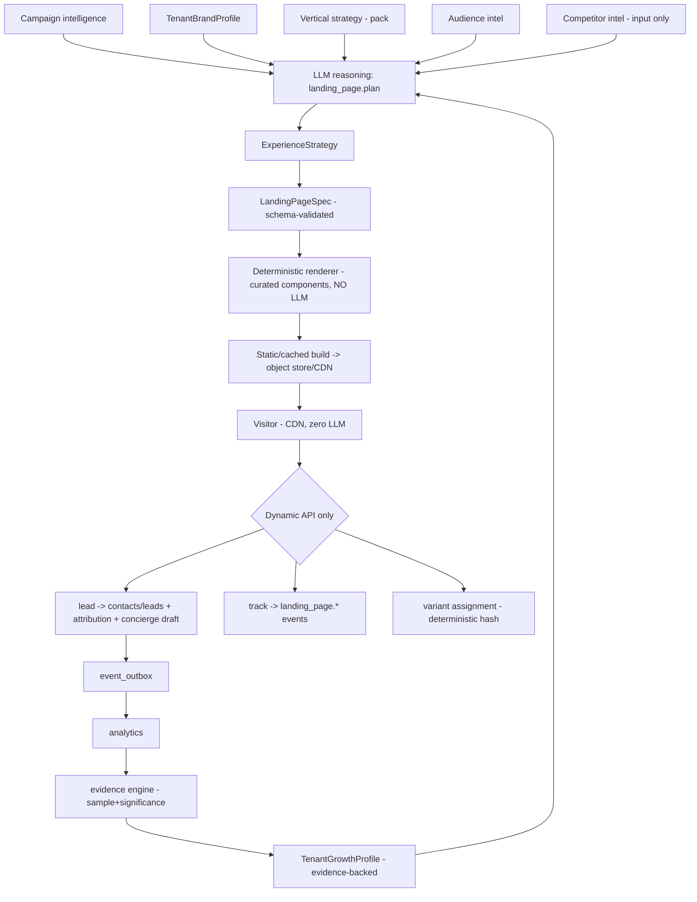

# Autonomous Landing-Page Capability — Design (v2, reconciled with the architecture delta)

**Status:** design review for founder approval. **No code written yet.**
**North-star principle:** *Growth Operator should learn how each tenant **grows**, not merely generate
marketing assets.* The landing page is one mechanism in a closed learning loop — **a campaign-aware
conversion surface** GO generates → publishes → measures → experiments on → learns from → improves per
tenant. The LLM makes **semantic decisions**; deterministic software does **mechanical work**; a page
request never invokes an LLM.

> **Rule:** use LLMs for *semantic* decisions (audience, offer framing, copy, CTA, section selection,
> strategy, hypotheses, qualitative analysis). Use deterministic code for *everything mechanical*
> (HTML/CSS, rendering, validation, image ops, publishing, caching, routing, UTM, experiment
> assignment, lead submission, attribution, stats, versioning, rollback, security). "Local" ≠ "free" —
> prefer deterministic code over a local LLM whenever it can solve the problem.

---

## 1. Layer ownership (L0 / L1 / L2 / L3) — §34.1–5

| Layer | Owns (for landing pages) | Repo home |
|---|---|---|
| **L0 Core / platform** | domain model; `PageSpec` + `ExperienceStrategy` schemas; **component contracts**; deterministic renderer; publishing lifecycle; versioning/rollback; domain routing; tracking; **generic experiment framework**; lead capture; attribution integration; analytics events; security; consent; approval integration | **`core/landing/`** (generic — **no vertical nouns**) |
| **L1 Vertical pack** | vertical conversion strategy; component *preferences*; trust signals; CTA patterns; page-planning guidance; compliance; content rules | **`verticals/<v>/landing/`** (declarative) |
| **L2 Tenant** | **TenantBrandProfile** (identity); business facts; products/services; policies; geography; preferred channels; custom domain; conversion prefs; **TenantGrowthProfile** (learned) | `tenant_settings` (brand, growth-profile), `contacts`/catalog, `agent_memory` |
| **L3 Runtime** | campaign; landing-page instance; page version; experiment; variant assignment; visitor/session; CTA interaction; lead/conversion; attribution; runtime analytics | `landing_pages`, `landing_page_versions`, `landing_page_events`, `campaigns`, `attributions`, `leads` |

**Rule Zero:** core may know `trust_signal`, `appointment_cta`, `product_grid`, `social_proof`; it must
**not** know `diamond certification`, `22K gold`, `bridal collection`, `karat` — those live in the
jewelry pack.

---

## 2. Key concepts introduced by the delta

- **ExperienceStrategy (NEW, first-class — §34.6):** the semantic layer *between* campaign and page.
  `CampaignStrategy → ExperienceStrategy → LandingPageSpec`. It captures the **decisions** (conversion
  goal, primary/secondary CTA, audience intent + awareness stage, page depth, offer framing, trust &
  objection strategy, product focus, social-proof strategy, pricing visibility, form strategy, visual
  strategy, **message-match requirements**). The `LandingPageSpec` is then the *executable* form of that
  strategy. Keeping them separate keeps strategy independent of rendering.
- **TenantBrandProfile (identity) vs TenantGrowthProfile (learned) — §34.7 — kept SEPARATE:**
  - *Brand* answers "what should this business look/sound like?" — colors, fonts, logo, tone, vocabulary,
    button/spacing tokens, image style. Stored as a `brand` tenant-setting; consumed by the renderer.
  - *Growth* answers "what has actually been **proven** to work for this tenant?" — e.g. "WhatsApp CTA
    beats lead forms," "visible pricing converts for everyday jewelry," "bridal traffic → appointment
    booking." **Evidence-backed, cross-channel reusable** (ads, WhatsApp, email, SEO, merchandising — not
    landing-page-only, §34.14/§14). Curated on top of existing tenant memory (`agent_memory`), **never
    raw metrics**.
- **Evidence hierarchy (§34.8 / §4) — don't learn noise:**
  `raw events → aggregated metrics → experiment results → evidence (sample size + significance + window +
  context) → validated insight → TenantGrowthProfile`. A finding graduates to durable strategy only with
  sufficient support (experiment_id, sample, conversion delta, confidence, audience, page type,
  objective, supporting events). "Variant B won after 14 visitors" must **not** become tenant memory.
- **General experiment abstraction (§34.11 / §22):** experiments are modelled **subject-agnostic**
  (`subject_type ∈ landing_page | ad | message | offer | …`) so ad/WhatsApp/email experiments reuse it
  later; **landing pages are the first consumer.** Answers: *what changed? who saw it? vs what control?
  what business outcome moved? how confident?*
- **PageSpec + component contracts:** the AI selects from an **approved component library** (Hero,
  ProductHero, OfferHero, CollectionGrid, ProductGrid, BenefitGrid, TrustBar, SocialProof, Testimonials,
  ReviewSummary, FAQ, Comparison, Guarantee, StoreLocation, AppointmentCTA, WhatsAppCTA, PhoneCTA,
  LeadForm, EmailCapture, ProductInquiry, BookingForm, StickyCTA, Footer). **AI controls** selection /
  order / copy / assets / CTA / config; the **renderer controls** HTML / CSS / responsive / a11y /
  security / performance. The model **never** emits arbitrary HTML or JS.

---

## 3. Gap analysis (audit) — extend, don't duplicate (§34.15)

| Need | Status | Reuse/extend |
|---|---|---|
| Campaigns | Exists (`core/campaigns/*`) | a campaign requests a page (message-match) |
| Attribution | Exists (`attributions`, `campaign_touches`) | + utm/landing/variant |
| Marketing/competitor intel | Exists (`core/insights`, `core/competitors`, `agent_reports`) | planner **inputs** (never copy-clone, §15) |
| Tenant memory | Exists (`agent_memory`, `tenant_settings`) | brand + **evidence-graduated** growth profile |
| Vertical packs | Exists (`verticals/<v>` incl. `ui/`) | + `landing/` templates + strategy |
| Agent capability / mediation | Exists (archetypes/allowlist, bindings/grants, `core/mediation`) | `landing_page.*` tools → campaigner |
| Approvals / trust / execution tokens | Exists (`approval_policies`, `approvals`, `trust_ledger`, `execution_token_jti`) | publish gating + risk-aware autonomy |
| Workflow DSL | Exists | optional host for generate→approve→publish |
| Events/outbox | Exists (`event_outbox`, vault `topics.yaml`) | `landing_page.*` events |
| Media/object storage | Exists gated (`channels/whatsapp/media.py`, `ingestion/storage.py`) | assets + published static HTML + provenance |
| Leads/contacts/consent | Exists (`contacts`, `leads`, `suppressions`) | **the** CRM — **no second CRM** (§20) |
| Channels (WA/IG/Google) | Exists (CP-4 per-store creds) | WhatsApp CTA; IG/Google ad source; later CAPI/Google conv |
| Analytics | Exists (`metrics_daily`, insights ROI) | funnel + **downstream** (lead→qualified→sale→revenue, §21) |
| Experiments / public web serving / domains | **Missing** | **new** (general experiment model; public surface — hosting-gated) |

---

## 4. Generation pipeline + render strategy (static-on-publish) + LLM budget

**LLM budget:** `landing_page.plan` = **1 call** (ExperienceStrategy + Spec, cached); +1 per extra A/B
variant; +1 per optimization cycle at significance. **Zero** on validate/render/publish/serve/lead/
track/variant/analytics. → ~1–3 calls per campaign page; **never per pageview.**

---

## 5. Data model (org-scoped + RLS)

- **`landing_pages`** — id, org_id, campaign_id?, vertical, slug, status
  (`draft|generated|validated|awaiting_approval|approved|published|paused|archived`),
  current_version_id, conversion_goal, seo_index (default false=noindex, §18), domain_id?, experiment_id?,
  created_by, timestamps.
- **`landing_page_versions`** (immutable → rollback + provenance, §25) — id, page_id, org_id,
  **experience_strategy jsonb**, **spec jsonb** (validated), rendered_ref (object key), variant_label,
  source_context jsonb (campaign/audience/inputs + **model + prompt version**), **asset_provenance jsonb**
  (§26: merchant_upload|catalog|brand_library|licensed|ai|campaign_creative), created_by, approved_by,
  published_at.
- **`landing_page_events`** — funnel log (id, org_id, page_id, version_id, variant, session_id, type,
  utm/ad ids, ts); aggregated into metrics + fed to the evidence engine.
- **Reuse:** `contacts`/`leads` (capture → nurture → quote → sale → attribution, §20/21),
  `attributions` (+utm/landing/variant), `tenant_settings` (`brand`, `growth_profile`), `agent_memory`.
- **Phase 2:** `experiments` (**general**, subject-agnostic) + `experiment_variants` +
  `experiment_assignments`; `landing_page_domains` (kind: `go_subpath|go_subdomain|custom`) — modelled
  now so custom domains don't force a redesign.

---

## 6. Capabilities, public surface, approval

- **Mediation tools (tier-gated):** `landing_page.plan`, `.generate_spec`, `.preview`, `.validate`,
  `.publish`, `.pause`, `.rollback`, `.create_variant`, `.measure`, `.analyze`, `.optimize` — invoked by
  the **campaigner** (not a new agent persona, §5). Later a marketing-operator hierarchy can own them.
- **PUBLIC (unauth):** GET page (static), POST lead, POST/GET track, variant assignment. **Tenant from
  domain/slug, never from a payload.**
- **Approval/mediation (§34.12 / §24):** publishing a public page is a **side effect** → **execution
  token + approval**, **risk-aware**: high-risk changes (price, discount, guarantee, inventory/legal/
  health/financial/delivery claims, promo terms) require approval; low-risk (typography/spacing) can
  become autonomous **later**. MVP = **owner approval for every publish**; autonomous promotion = Phase 4
  via the trust ladder.

---

## 7. Events (§34.9 — reuse campaign attribution)

`landing_page.generated/validated/approved/published/paused`, `.viewed/cta_clicked/whatsapp_clicked/
phone_clicked/form_started/form_submitted/product_clicked/booking_started/converted`,
`.variant_assigned/experiment_completed`, `.assets_uploaded`. Each carries tenant/campaign/ad/creative/
page/version/variant/utm/click-id/conversion-goal → plugs into the **existing** attribution + campaign
analytics (no separate analytics universe). Registered in the vault `topics.yaml`.

---

## 8. Security · consent · provenance

- Tenant from domain/slug; **generated content untrusted** → fixed component library + all copy escaped;
  **strict CSP**; external scripts (pixel/GA) only when tenant-configured **with consent**. Public
  endpoints rate-limited + bot/spam-guarded. RLS everywhere; publish/rollback audited.
- **Consent (DPDP):** explicit **marketing opt-in separate** from transactional contact; `suppressions`
  respected; a phone number is not blanket marketing permission.
- **Asset provenance** recorded; real approved product imagery preferred — **no silent AI substitution**
  where product accuracy matters (critical for jewelry, §26).

---

## 9. Domain strategy — §16

MVP = one GO host, **path per store** (`pages.<godomain>/<store>/<slug>`, one TLS cert). Phase 2 =
merchant custom subdomain (`offers.store.com`) via CNAME + verification + managed TLS; GO invisible.
`landing_page_domains` abstracts the host. **Public serving needs deployed infra + a domain → gated on
hosting (#8/#10); India residency (#8) matters for captured PII.**

---

## 10. Phasing (§30) + MVP boundary

- **Phase 1 — Conversion Surface (MVP):** ExperienceStrategy + PageSpec + component contracts +
  deterministic renderer + jewelry template + brand tokens + campaign linkage (message-match) + GO-hosted
  URL + lead form + WhatsApp CTA + UTM/attribution + core events + approval + versioning + rollback + RLS
  + security tests + the owner **asset-upload → auto-generate** trigger. *(Live public serving deferred to
  hosting.)*
- **Phase 2 — Measurement & Experimentation:** general experiment model + A/B; custom domains + TLS;
  qualified-lead & downstream attribution; Meta CAPI + Google conversions; richer analytics; more
  components; operator oversight UI.
- **Phase 3 — Tenant Learning:** evidence engine → **TenantGrowthProfile**; cross-campaign learning;
  recommendations; automatic strategy reuse.
- **Phase 4 — Autonomous CRO:** automatic variant generation; traffic allocation; guardrailed winner
  promotion (trust ladder).
- **Phase 5 — Omnichannel Experience Intelligence:** reuse TenantGrowthProfile across ads / WhatsApp /
  email / SEO / AEO-GEO / merchandising / website / offers.

**Explicitly deferred from MVP (§34.14):** custom domains, autonomous optimization, full personalization/
GrowthProfile, Meta CAPI/Google/GA4, SEO/AEO generation, Shopify/Woo publishing, advanced experimentation,
real-time personalization, AI-generated media.

**LP tickets — split into small, independently-shippable sub-tickets (founder, 2026-08-12: "split each
LP into multiple tickets with clear scope … knock out one by one"). Each = its own branch → rigorous
tests → CI-green → merge/push to main, like LP-1.**

- **LP-1 (DONE — `27530f1`):** *deterministic foundation, no LLM / no publish / no public serving / no
  agent.* Migration 045 (`landing_pages`, `landing_page_versions`, `landing_page_events`, RLS/FORCE +
  SECDEF); typed `LandingPageSpec` + `ExperienceStrategy` + component contracts + validator;
  deterministic renderer (`core/landing`, generic, premium/bolder UX) + jewelry template; `brand`
  setting; owner create + **preview** + public `/track`. Tests: validation/render/sanitisation/isolation.
- **LP-1b (DONE — `27530f1`):** per-item first-party data capture — migration 046 (`item_ref` + `meta`),
  enriched beacon (utm/referrer/device/scroll/dwell + WhatsApp deep-link), whitelisted+clamped `/track`,
  `GET /pages/{id}/insights` (top items by interest).

Phase-1 remainder (the split of the old "LP-2/3/4"):
- **LP-2a — Variant generation:** `plan_variants` → **N (≈3) genuinely different-UX** candidates
  (deterministic, generic; LLM strategy-selection deferred to LP-2c); persist N `landing_page_versions`;
  owner API to generate + **preview each variant**. *No lifecycle/approval yet. No migration.*
- **LP-2b — Lifecycle + owner approval (HITL #1):** status machine (generated→awaiting_approval→approved
  →published→paused→archived) + **select/approve one** variant (reuse `core/approvals`) + versioning/
  rollback + publish[mark+record, live serving hosting-gated]/pause. Approval gate enforced + tested.
- **LP-2c — Gated LLM strategy planner** (founder 2026-08-12: split LP-2c/LP-2d): the marketing
  agent's *semantic* decisions (section selection/order, framing, depth) → `ExperienceStrategy`,
  **validated against the schema + component contracts**, with a **deterministic fallback**. Gated
  **off/simulated by default and in tests** (no network); model output is untrusted → it may only
  reorder/subset the pack's real sections, **never invent copy or components**. Touches `core/landing`
  only. Makes LP-2a's variant generation "the marketing agent's suggestions."
- **LP-2d — Agent mediation tools + approval rule:** `landing_page.{plan,generate,validate,publish,
  pause,rollback}` in the mediation `REGISTRY` + `campaigner` `capability_allowlist`/`tool_grants` +
  a **publish approval-rule (tier ≥ 2)** so an agent-initiated publish **parks for owner approval**
  (HITL #1 on the agent path). Touches `core/mediation`, `core/approvals`, the pack. The agent's hands.
- **LP-3a — Public serving surface:** public router serves the published static/cached page
  (tenant-from-path) + CSP/noindex + `/track` rate-limit/bot defence. *(Live serving hosting-gated.)*
- **LP-3b — Lead capture → CRM + concierge draft:** public lead POST → contacts/leads + attribution +
  concierge auto-drafts a WhatsApp follow-up for approval (consent).
- **LP-3c — Attribution + outbox events:** UTM/campaign/variant into `attributions`; `landing_page.*`
  outbox events (vault + `spec/` sync) into the existing campaign attribution.
- **LP-4a — Owner web `LandingPagesSection`:** view pages/variants, preview, pick/approve, funnel analytics.
- **LP-4b — Upload → auto-generate trigger + notification:** owner uploads media → GO detects →
  auto-generates the N variants → notifies owner to pick (LP-2a + LP-4a). The "upload button" flow.

Then (Phase 2+, separate families): **CAMP-1** (ad launch, HITL #2, gated Instagram/Google Ads adapters)
· **EXP-\*** (general experiment model + A/B) · **DOM-\*** (custom domains + TLS) · **CAPI-\*** (Meta/
Google conversions) · **GROW-\*** (TenantGrowthProfile/learning) · **CRO-\*** (autonomous) · **OMNI-\***.

---

## 11. §34 reconciliation — quick index

1. L0/L1/L2/L3 fit → §1. 2. Generic-in-core / 3. vertical / 4. tenant / 5. runtime → §1 table.
6. ExperienceStrategy first-class → **yes**, §2. 7. Brand vs Growth profile → §2 (separate).
8. Evidence graduation → §2 evidence hierarchy. 9. Events reuse attribution → §7. 10. Existing lead
records (no 2nd CRM) → §5/§20. 11. Generalize experiments → §2 (subject-agnostic, LP first consumer).
12. Approval/mediation → §6 (risk-aware, execution-token). 13. Smallest MVP → **LP-1**, §10. 14. Deferred
→ §10. 15. Extend not duplicate → §3.

---

## Confirmed decisions (founder, 2026-08-12)

Render = static-on-publish · MVP host = **path per store** (`pages.<godomain>/<store>/<slug>`) · publish =
**owner approval** (autonomy = Phase 4) · lead submit → create lead + attribute + **concierge auto-drafts
a WhatsApp follow-up for approval** · **build the MVP, live serving deferred to hosting** · domain name TBD
by founder at publish time. **This v2 reconciles the architecture delta; implementation begins at LP-1
only on founder go-ahead.**
